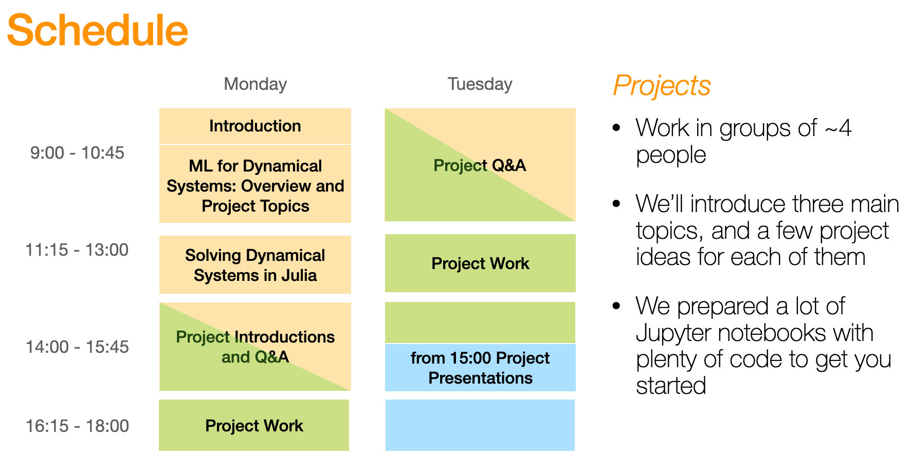

# Machine Learning for Dynamical Systems Workshop at TIPES/CriticalEarth Winter School 23

The material for the workshop is mostly presented in the form of Jupyter notebooks. While they also do work directly in the browser on GitHub, some graphics are not displayed correctly. We recommend that you clone this repository to your hard drive and start a local Jupyter notebook server in the root folder of the repository (command `jupyter notebook`). 
 

## Contents 

* [Welcome & introduction to the workshop](Introduction-Talk.pdf)
* [Solving Dynamical Systems numerically in Julia](julia_crash_course.ipynb)
* [Machine Learning for Dynamical Systems Overview](ML-DS-Overview.ipynb)
* [Project Method I: Neural Differential Equations](projects/NeuralDifferentialEquations/NeuralDifferentialEquations.ipynb)
* [Project Method II: Reservoir Computing](projects/ReservoirComputing/reservoir_computing.ipynb)
* [Project Method III: Symbolic Regression / SINDy](projects/SINDy/SINDy.ipynb)

* [Julia cheat sheet (external link)](https://cheatsheet.juliadocs.org)
